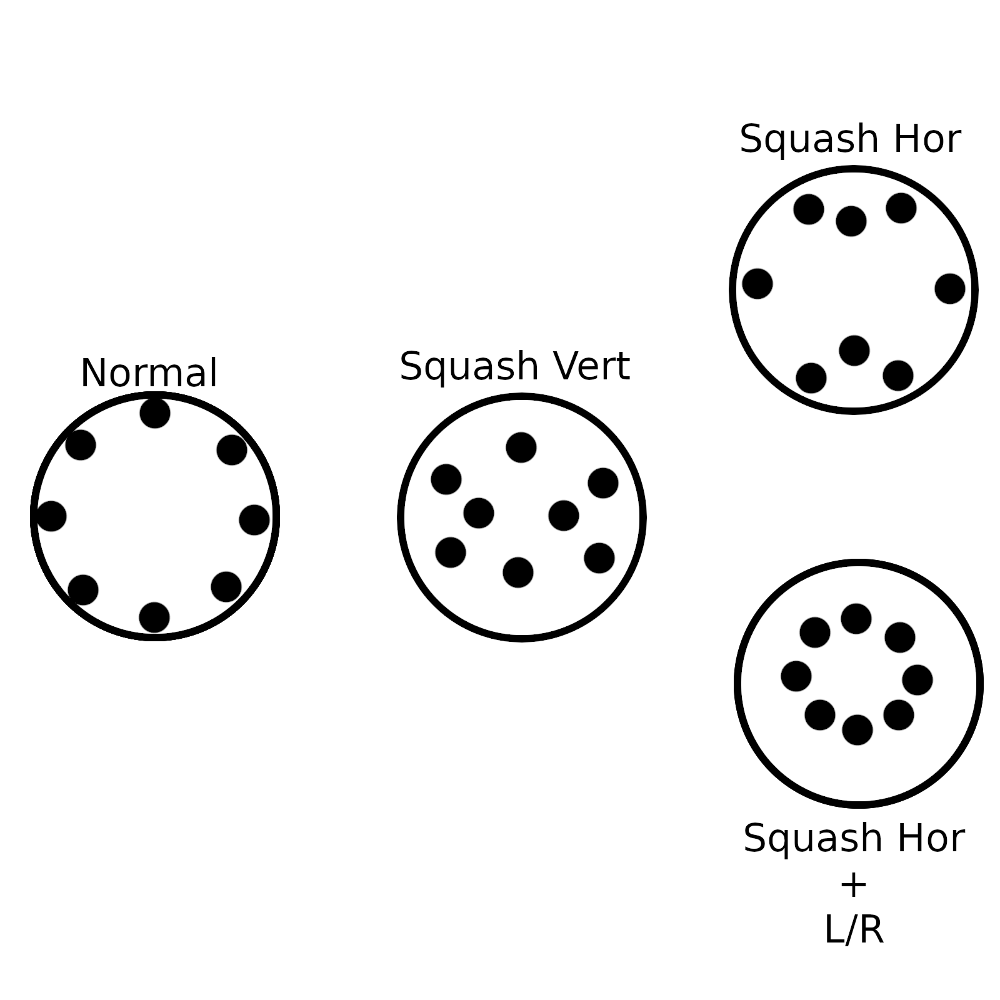

# Open GC Box

## Description

An open source hitbox-style controller for GameCube

## Layout


### Basics

Your hands can default to:

- Left: four fingers on L, Left, Down, and Right with thumb on Y
   + Your left thumb can reach to X (although it shouldn't be necessary).
   + Your left thumb can reach to Up
- Right: four fingers on C Left, C Down, C Right, and Squash Vert with thumb on C Up
   + Your right four fingers can drop down to Z, B, R, and Squash Hor
   + Your index finger can reach A
   + Your ring finger can reach Light Shield

Default values for analog inputs:
- Up, down, left, and right will register 1.0 individually or (0.7, 0.7) together
- R and L register all the way down while Light Shield registers lightly pressed analog right
- C directions are full C-stick hits

### Modifiers

There are two buttons which modify the distance of the directional inputs.

One button, Squash Vert (SV), squashes the inputs on the vertical axis, allowing you to walk, do up/down tilts, long wavedashes, and horizontal Firefox angles. Here are the modified values:

- X alone: 0.6625
- Y alone: 0.5375
- X + Y: (0.7375, 0.3125), a 23 degree angle

The other button, Squash Hor (SH), squashes the inputs on the horizontal axis, allowing you to do the other set of Firefox angles/short wavedashes. Modified values:

- X alone: 0.3375
- Y alone: 0.7375
- X + Y (0.3125, 0.7375), a 67 degree angle

Additionally, when Squash Hor is used in conjunction with R, L, or Light Shield, it will allow you to tilt your shield.

Visual example:



## Contributing

There are a few requirements for contributing. If your PR does not meet these requirements, then it will be rejected.

1. Match the code style of the file you're in or match the code style of the rest of the project when making a new file.
2. Sign your commits and use the following format:
   ```
   file_name: short message

   Optional detailed explanation of commits
   That can be multiline

   Signed-off-by: Your Name <your.email@whatever.com>
   ```

   You need to use this format as we use git commits to track history and only allow rebase PRs.

